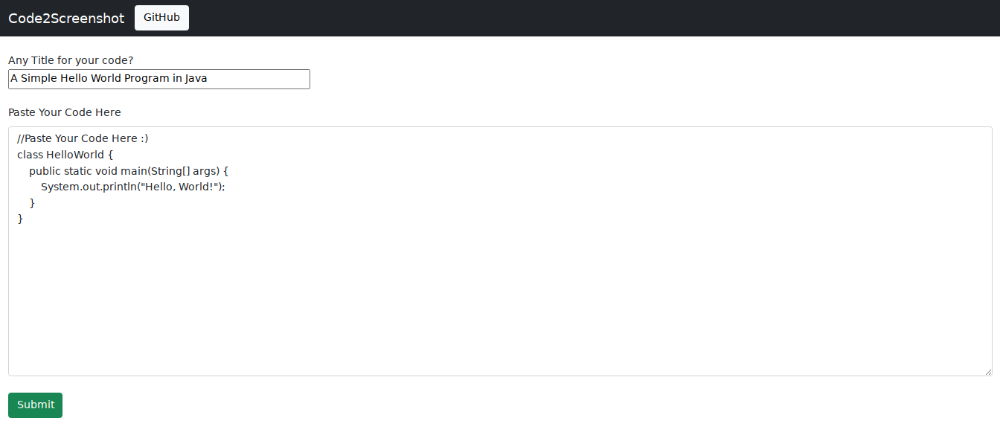
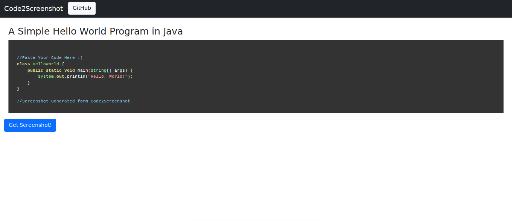
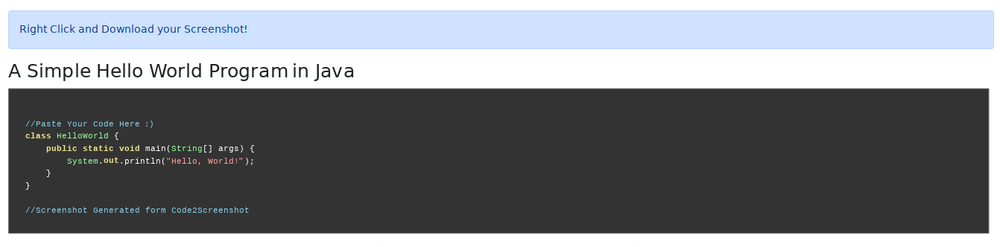
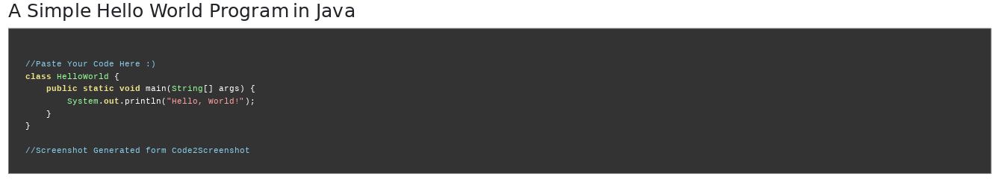

  <h1 align="center">Code2Screenshot</h1>

### Simple and Easy to use tool! :) 
### Tool available Online at: <a href="https://quantumdrive.000webhostapp.com/Code2Screenshot/">Code2Screenshot</a>

 

# How to use?
<h2>
Step 1: Paste your code and Give it a Title  
  
Step 2: After pressing "Submit" button, check your output  
  
Step 3: Everything Fine? Then Click "Get Screenshot" Button!  
  
Step 4: Right Click and Save your Screenshot  
  
</h2>

<h3>That's it! :)</h3>
